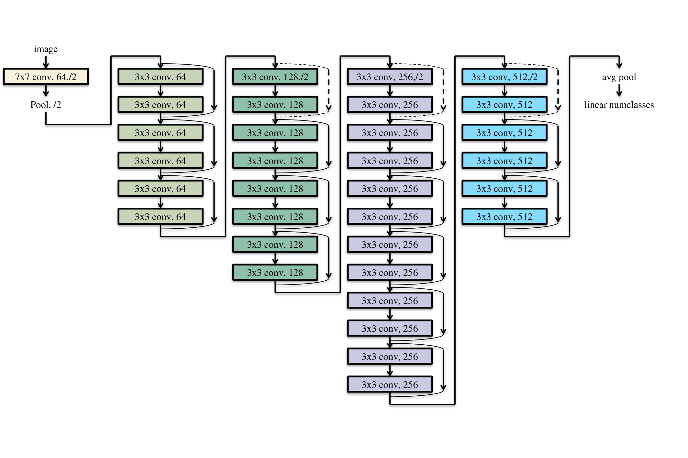

# pytorch-combinators
Combinators are a concept from functional programming. 
The term describes a form of higher order function which takes one or more functions as parameters (possibly in addition to other data) and gives back a new function. 
They have proved to be very effective at building modular, composable toolboxes for libraries and frameworks.

The idea that drives this little project is that neural networks can be thought of as *learning functions*. 
If we take a PyTorch module, we usually think of it as a class, but that is to manage data, the learning parameters etc... inside it that will be trained. 
The execution is the forward method, and this is usually a rather pure transformation, once training has taken place. 
So, the proposal is, that we can build a small toolbox of combinators that abstract common patterns that are useful in building up bigger neural networks. 

ADVANTAGES OF CONCEPT? 
     PARAMETERS CHANGE BEHAVIOR   / PARACHUTE IN COMPLEX SUB PROCESSES, INCLUDING LEARNING PROCESSES
     STRUCTURE OPTIONS

# Examples

## ResNet34

Resnet is a convolution based vision recognition network making heavy use of residual connections. 
It was introduced in 2016 and several variations on it have been some of the most successful image classifiers created. 

In the example folder you can find a version of the network structured using the combinator library. 
To compare the code to the diagram, this diagram was inspired by similar diagrams in the paper by [He et al (2016)](#resnet_reference) 

<p align="center">

</p>

The code in the example folder (./examples/ResNet34.py) looks like this;

```python
def my_resnet34(numClasses):
    entry_block=nn.Conv2d(3, 64, kernel_size=7, stride=2,padding=3,bias=False)\
                   |seq| nn.BatchNorm2d(64)\
                   |seq| nn.ReLU(inplace=True)\
                   |seq| nn.MaxPool2d(kernel_size=3, stride=2, padding=1)

    block1 = repeat(3,basic_block(64))
    block2 = reshaping_block(64,128) |seq| repeat(3,basic_block(128))
    block3 = reshaping_block(128,256) |seq| repeat(5,basic_block(256)) 
    block4 = reshaping_block(256,512) |seq| repeat(2,basic_block(512)) 
    exit_block = nn.AdaptiveAvgPool2d((1, 1)) |seq| nn.Flatten(1) |seq| nn.Linear(512, numClasses)

    return entry_block |seq| block1 |seq| block2 |seq| block3 |seq| block4 |seq| exit_block
```

To run this it also needs the following 2 block types;

```python
def basic_block(n):
    return residual(
        nn.Conv2d(n, n, kernel_size=3, stride=1, padding=1, bias=False)
        |seq| nn.BatchNorm2d(n)
        |seq| nn.ReLU(inplace=True)
        |seq| nn.Conv2d(n, n, kernel_size=3, stride=1, padding=1, bias=False)
        |seq| nn.BatchNorm2d(n)
    ) |seq| nn.ReLU(inplace=True)

def reshaping_block(a,b): 
  f= nn.Conv2d(a, b,\
            kernel_size=3,\
            stride=2,\
            padding=1,\
            bias=False)\
     |seq| nn.BatchNorm2d(b)\
     |seq| nn.ReLU(inplace=True)\
     |seq| nn.Conv2d(b, b, \
                  kernel_size=3, \
                  stride=1,\
                  padding=1,\
                  bias=False)\
     |seq| nn.BatchNorm2d(b)
  downsample = nn.Conv2d(a, b,\
                      kernel_size=1,\
                      stride=2,\
                      bias=False)\
               |seq| nn.BatchNorm2d(b)
  recombine=lift(lambda x:x[1][0]+x[1][1])
  return probe(recombine,f,downsample)\
         |seq| nn.ReLU(inplace=True)
```     

A training example can be seen in Demo_ResNet34.py, which is fairly normal PyTorch training code, based on the PlantVillage dataset [(Mohanty et al., 2016)](#plantvillage_reference) . 
            
# References

<a id="resnet_reference"></a>
- He, K., Zhang, X., Ren, S., Sun, J., 2016. Deep residual learning for image
recognition, in: 2016 IEEE Conference on Computer Vision and Pattern
Recognition (CVPR), pp. 770–778. [doi:10.1109/CVPR.2016.90](https://doi.org/10.1109/CVPR.2016.90).

<a id="plantvillage_reference"></a>
- Mohanty, S.P., Hughes, D.P., Salathé, M., 2016. Using deep learning for
image-based plant disease detection. Frontiers in Plant Science 7, 1419.
[doi:10.3389/fpls.2016.01419](https://doi.org/10.3389/fpls.2016.01419).


